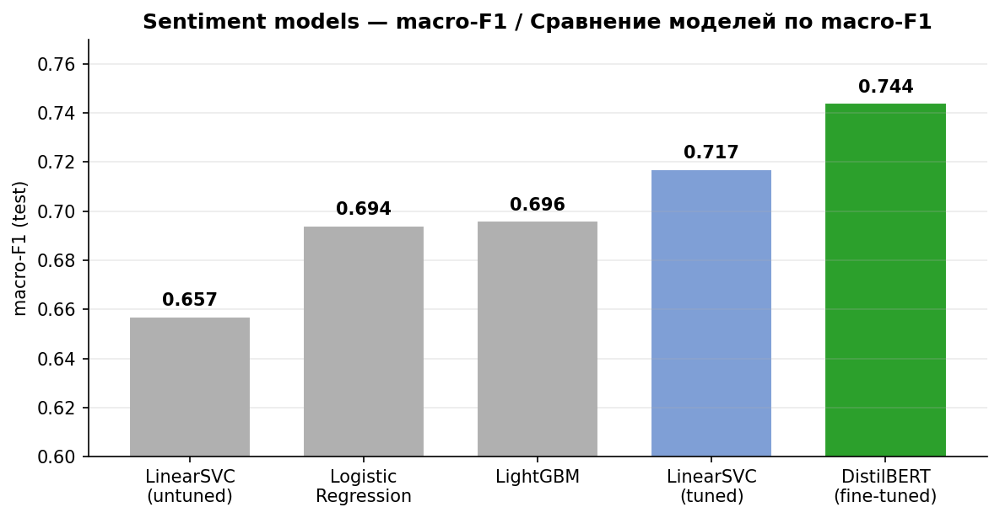
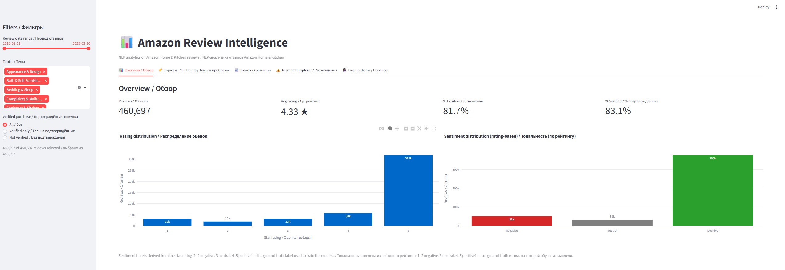
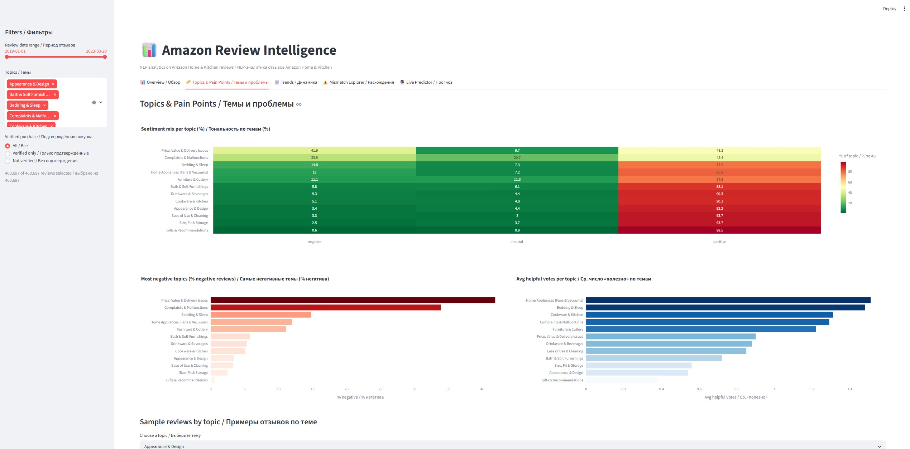
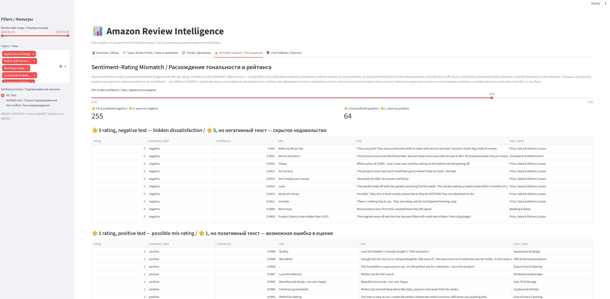
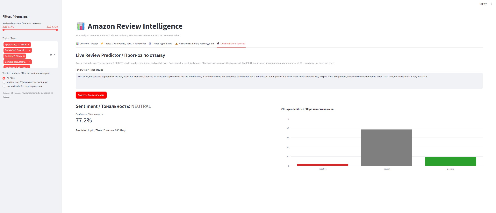
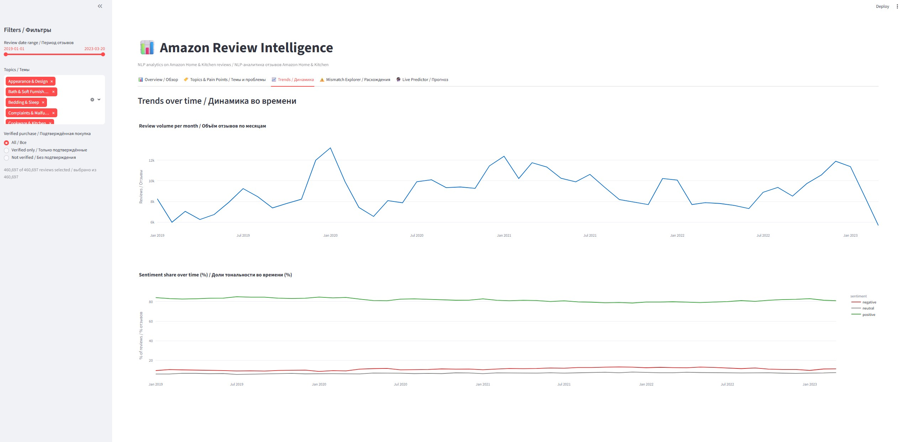

# Amazon Review Intelligence

End-to-end NLP-проект: от сырого JSONL с сотнями тысяч отзывов Amazon до интерактивного двуязычного дашборда с sentiment-анализом, тематическим моделированием и live-предсказанием.

**Проблема.** У продавца на Amazon (категория Home & Kitchen) — сотни тысяч отзывов. Звёздный рейтинг показывает *насколько* доволен покупатель, но не *что именно* пошло не так и где скрытое недовольство (5★ с раздражённым текстом). Вручную это не прочитать.

**Решение.** Пайплайн, который превращает сырой текст в аналитику: классифицирует тональность (3 класса), выделяет 12 тем и customer pain points, находит расхождения «рейтинг vs текст» и отдаёт всё это в дашборд с предсказанием в реальном времени. Пять моделей сравнены честно (один `train_test_split`, та же разметка); лучшая — дообученный **DistilBERT**.

**Результат.**
- **DistilBERT: macro-F1 0.744, neutral recall 0.69** — обходит и настроенный baseline (0.717), и классику на TF-IDF.
- Локализованы pain points: *Price, Value & Delivery Issues* — **41.8% негатива**, *Complaints & Malfunctions* — 34.1%.
- Mismatch-анализ: **11.3% всех 1★** имеют позитивный текст — сигнал об ошибочно занижённых оценках.
- Интерактивный **Streamlit-дашборд** (RU/EN) с 5 вкладками и live-предиктором.



> ### Честно об ограничениях
> Тональность выведена из **звёздного рейтинга** (weak supervision), а не из ручной разметки текста: 1–2★ → negative, 3★ → neutral, 4–5★ → positive. Это даёт бесплатные метки на 460k отзывов, но платой идёт шум — особенно класс **neutral** (3★), который по тексту плохо отделим от соседних и тащит за собой низкий recall у всех моделей. Поэтому ключевая метрика — **macro-F1**, а не accuracy (датасет на ~82% positive). А mismatch-кейсы «рейтинг ≠ текст» — это смесь *реальных* расхождений и *ошибок модели*; в дашборде их можно отфильтровать по уверенности, но полностью разделить нельзя.

---

## Дашборд

Интерактивный Streamlit-дашборд с двуязычным (RU/EN) интерфейсом и пятью вкладками. Запуск — в разделе [Интерактивный дашборд](#интерактивный-дашборд-streamlit) ниже.

**Overview / Обзор** — KPI и распределения рейтингов и тональности:


**Topics & Pain Points / Темы и проблемы** — heatmap «тема × тональность», самые негативные темы:


**Mismatch Explorer / Расхождения** — отзывы, где текст противоречит звёздам (5★ + негатив, 1★ + позитив):


**Live Predictor / Прогноз** — ввод отзыва → тональность, уверенность и тема в реальном времени:


**Trends / Динамика** — объём отзывов и доли тональности по месяцам:


---

## Что внутри

| Этап | Содержание |
|------|------------|
| **1. Data Ingestion** | Чтение большого JSONL чанками + равномерная выборка 500k отзывов через reservoir sampling, фильтр по году (≥ 2019), кэш в parquet |
| **2. Data Cleaning** | Удаление дубликатов (по строке и по тексту), отсев слишком коротких отзывов |
| **3. NLP Preprocessing** | Очистка текста (HTML, contractions, пунктуация), объединение `title + text`, удаление стоп-слов |
| **4. EDA** | Распределение рейтингов, дисбаланс классов, частотный анализ слов и биграмм по тональности, динамика во времени |
| **5. Sentiment Analysis** | 3 baseline-модели на TF-IDF: Logistic Regression, **LinearSVC (calibrated)**, LightGBM; error analysis, сравнение по accuracy / macro-F1 / weighted-F1 |
| **6. Topic Modeling** | LDA (12 тем) на CountVectorizer, бизнес-разметка тем, topic × sentiment, динамика тем во времени |
| **7. Mismatch Analysis** | Расхождения звёздного рейтинга и предсказанной тональности (с фильтром по confidence) |
| **8. Insight Fusion** | Самые негативные темы, helpful votes и verified purchase в разрезе тем, sentiment-тренды |
| **9. Dashboard** | Сводные визуализации |
| **10. Deployment** | End-to-end Pipeline `сырой текст → очистка → модель`, сохранение и проверка |
| **11. Baseline tuning (LinearSVC)** | `RandomizedSearchCV` по `C` и параметрам TF-IDF, оптимизация по macro-F1; настроенный baseline (macro-F1 0.657 → 0.717, neutral recall 0.17 → 0.46) |
| **12. Transformer (DistilBERT)** | Дообучение DistilBERT на сыром тексте (GPU, fp16, взвешенный loss) — **лучшая модель проекта** (macro-F1 0.744, neutral recall 0.69) |
| **13. BERTopic vs LDA** | Тематическое моделирование на смысловых эмбеддингах (MiniLM) как сравнение с LDA; исследовательский раздел, осознанный выбор LDA для дашборда |

---

## Структура проекта

```
Amazon Review Intelligence/
├── Amazon Review Intelligence.ipynb   # основной ноутбук
├── app.py                             # интерактивный Streamlit-дашборд
├── build_dashboard_data.py            # пересчёт обогащённого parquet для дашборда
├── nlp_utils.py                       # общие функции очистки текста (ноутбук + дашборд)
├── distilbert_utils.py                # инференс DistilBERT для дашборда
├── data/
│   ├── Home_and_Kitchen.jsonl         # исходные данные (не в git)
│   ├── reviews_processed.parquet      # кэш выборки (не в git)
│   └── reviews_dashboard.parquet      # обогащённые данные для дашборда (не в git)
├── models/                            # обученные артефакты (не в git)
│   ├── log_reg_pipeline.joblib
│   ├── svc_pipeline.joblib
│   ├── lightgbm_pipeline.joblib
│   ├── lda_model.joblib
│   ├── topic_vectorizer.joblib
│   ├── final_sentiment_model.joblib   # деплой-модель (raw text → sentiment)
│   ├── svc_tuned_pipeline.joblib      # настроенный LinearSVC (раздел 11)
│   └── distilbert_sentiment/          # дообученный DistilBERT (раздел 12)
├── requirements.txt
├── .gitignore
└── README.md
```

---

## Установка и запуск

```bash
python -m venv .venv
.venv\Scripts\activate          # Windows
pip install -r requirements.txt
jupyter notebook "Amazon Review Intelligence.ipynb"
```

> **Важно:** артефакты в `models/` сериализованы под `scikit-learn==1.7.2`.
> При другой версии загрузка падает с `NotFittedError: idf vector is not fitted`
> (несовместимость pickle между версиями). Используйте версии из `requirements.txt`
> либо удалите `models/*.joblib` — ноутбук переобучит модели заново.

Данные: [Amazon Reviews 2023 (McAuley Lab, UCSD)](https://amazon-reviews-2023.github.io/), категория *Home & Kitchen*.
Скачать `Home_and_Kitchen.jsonl` и положить в `data/`. При наличии `reviews_processed.parquet`
шаг ingestion пропускается.

---

## Интерактивный дашборд (Streamlit)

```bash
# 1. один раз пересчитать обогащённые данные (sentiment, темы, предсказания модели)
python build_dashboard_data.py        # создаёт data/reviews_dashboard.parquet (нужен GPU)
# 2. запустить дашборд
streamlit run app.py                  # откроется на http://localhost:8501
```

Предсказания тональности в дашборде делает **дообученный DistilBERT** (лучшая модель из раздела 12),
темы — LDA. Дашборд загружает готовый parquet и модели и ничего не переобучает. Вкладки:

| Вкладка | Что показывает |
|---|---|
| **📊 Overview** | KPI (кол-во, ср. рейтинг, % позитива/verified) + распределение рейтингов и тональности |
| **🏷️ Topics & Pain Points** | Heatmap «тема × тональность», самые негативные темы, helpful votes по темам, примеры отзывов |
| **📈 Trends** | Объём отзывов и доли тональности по месяцам |
| **⚠️ Mismatch Explorer** | Расхождения рейтинга и предсказанной DistilBERT тональности (слайдер по confidence) |
| **🔮 Live Predictor** | Ввод своего отзыва → тональность + confidence (DistilBERT) + тема в реальном времени |

> `build_dashboard_data.py` повторяет очистку и разметку из ноутбука, прогоняет **DistilBERT**
> и LDA по всем отзывам, сохраняя slim-parquet — поэтому дашборд грузится мгновенно. Инференс
> DistilBERT требует GPU-сборки torch, поэтому на Windows скрипт запускают из PowerShell.
> Препроцессинг текста вынесен в `nlp_utils.py`, инференс DistilBERT — в `distilbert_utils.py`.

> ⚠️ **Охват отличается от ноутбука.** Дашборд считает предсказания тональности и темы
> по **всем** ~460k отзывам, тогда как в ноутбуке предсказания делались на test-выборке
> (20%), а topic modeling — на сэмпле 200k. Поэтому абсолютные числа mismatch-кейсов в
> дашборде будут больше, чем в ноутбуке (доли при этом сопоставимы).

---

## Целевая переменная

Тональность выводится из звёздного рейтинга (weak supervision):

| Rating | Sentiment |
|--------|-----------|
| 1–2    | negative  |
| 3      | neutral   |
| 4–5    | positive  |

Датасет сильно несбалансирован (~82% positive), поэтому ключевая метрика — **macro-F1**, а не accuracy.

---

## Ключевые результаты

Sentiment-классификация (3 класса, тестовая выборка 92 140 отзывов):

| Модель | accuracy | macro F1 | weighted F1 |
|---|---|---|---|
| Logistic Regression | 0.862 | **0.694** | 0.879 |
| **LinearSVC (calibrated)** | **0.901** | 0.657 | **0.886** |
| LightGBM | 0.859 | 0.696 | 0.877 |

- **Деплой-baseline — LinearSVC** (calibrated): лучшие accuracy (0.90) и weighted-F1
  (0.886) среди трёх baseline. Калибровка через `CalibratedClassifierCV` даёт `predict_proba`,
  поэтому SVC — единая модель и для анализа уверенности, и для лёгкого CPU-деплоя
  (`final_sentiment_model.joblib`). Цена — низкий recall на классе **neutral** (0.17) и
  худший из трёх macro-F1 (0.657).
- **Лучшая модель проекта — DistilBERT** (раздел 12, macro-F1 **0.744**, neutral recall 0.69);
  именно она считает предсказания в дашборде. Роли разведены намеренно: LinearSVC — быстрый
  CPU-baseline для деплоя, DistilBERT — максимальное качество на GPU для аналитики.
- Самый сложный класс — **neutral** (rating 3): путается с positive/negative, что
  ожидаемо для weak-labeled данных.
- Topic modeling (12 тем) выделяет customer pain points: наиболее негативные темы —
  *Price, Value & Delivery Issues* (41.8% negative) и *Complaints & Malfunctions*
  (34.1%); самые позитивные — *Gifts & Recommendations* и *Ease of Use & Cleaning* (>93%).
- Mismatch-анализ: «1★ + positive» встречается чаще (11.3% всех 1★), чем «5★ + negative»
  (0.5% всех 5★) — модель смещена к positive. Фильтр по confidence (≥0.70) отсекает ~70%
  как вероятные ошибки модели, оставляя реальные расхождения.

> ⚠️ LDA не гарантирует стабильность индексов тем между переобучениями: бизнес-метки
> в ноутбуке (`topic_labels`) сопоставлены по топ-словам и при повторном обучении модели
> требуют перепроверки по выводу `print_topics`.

---

## Experiment: настроенный baseline vs Transformer (DistilBERT)

Разделы **11–12 ноутбука** проверяют, побьёт ли контекстный трансформер классический baseline —
и насколько помогает честный тюнинг самого baseline. Все сравнения честные: **тот же**
`train_test_split` (`random_state=42`), та же разметка, та же тестовая выборка (92 140 отзывов).

- **LinearSVC (tuned)** (раздел 11): `RandomizedSearchCV` по `C` и параметрам TF-IDF, оптимизация
  по macro-F1, на полном train (CPU).
- **DistilBERT** (раздел 12): сырой текст (`title + text`), GPU (RTX 3090, fp16, 2 эпохи, ~16 мин),
  **взвешенный loss** против дисбаланса ~82/11/7.

| Модель | accuracy | macro F1 | weighted F1 | recall (neutral) |
|---|---|---|---|---|
| Logistic Regression | 0.862 | 0.694 | 0.879 | 0.60 |
| LinearSVC (calibrated, **untuned**) | **0.901** | 0.657 | 0.886 | 0.17 |
| LightGBM | 0.859 | 0.696 | 0.877 | 0.62 |
| LinearSVC (**tuned**, `C≈0.06`) | 0.896 | 0.717 | 0.899 | 0.464 |
| **DistilBERT (fine-tuned)** | 0.889 | **0.744** | **0.903** | **0.692** |

- **Тюнинг сильно недооценённого baseline:** macro-F1 LinearSVC вырос **0.657 → 0.717 (+6.0 п.п.)**,
  neutral recall **0.17 → 0.46**. Главный фактор — сильная регуляризация (`C≈0.06` против дефолтного `1.0`).
- **DistilBERT всё равно выигрывает** по обеим ключевым метрикам: macro-F1 **0.744** vs 0.717 и
  особенно neutral recall **0.69** vs 0.46. Контекст даёт устойчивое преимущество на самом сложном классе.
- Вывод: настроенный baseline закрывает бóльшую часть разрыва, но DistilBERT всё же выше по ключевым метрикам — за счёт учёта контекста, недоступного TF-IDF-моделям.

> DistilBERT требует GPU-сборки torch (`torch==2.2.2+cu121`) + `accelerate`. Код — в ноутбуке
> (разделы 11–12), модели кэшируются в `models/distilbert_sentiment/` и `models/svc_tuned_pipeline.joblib`
> (артефакты не версионируются); при наличии ячейки их загружают, иначе обучают/ищут заново.

---

## Дополнительно: BERTopic vs LDA (раздел 13)

Отдельный исследовательский раздел сравнивает LDA с **BERTopic** — тематическим моделированием на смысловых эмбеддингах (MiniLM, GPU). На выборке 50k отзывов:

- BERTopic сам нашёл около **65 тем** против заданных вручную **12** у LDA, и они конкретнее: где LDA даёт одну «Bedding & Sleep», BERTopic разделяет подушки, матрасы, простыни и одеяла.
- Около **46% отзывов** вынесены в группу «Прочее» — короткие общие отзывы («great», «works well») без выраженной темы. LDA распределил бы их принудительно.
- Цена: тяжелее (GPU + `bertopic`, `sentence-transformers`, `umap-learn`, `hdbscan`) и не детерминирован (UMAP вносит случайность).

**Инженерное решение:** в дашборде осознанно оставлен **LDA** — быстрый, воспроизводимый, мгновенно размечает все ~460k отзывов и укладывается в 12 интерпретируемых тем. BERTopic точнее и конкретнее, но 65 тем и 46% «Прочее» потребовали бы редизайна аналитики и пересчёта эмбеддингов на GPU по всему датасету. Компромисс *быстро + воспроизводимо* против *точно + тяжело* решён в пользу первого; BERTopic задокументирован как направление, к которому стоит переходить при необходимости детальной сегментации по конкретным товарам.

---

## Деплой-модель

`models/final_sentiment_model.joblib` — это `Pipeline`, который принимает **сырой**
текст (с HTML и contractions) и сам выполняет очистку, исключая рассинхрон
между train-time и inference-time препроцессингом:

```python
import joblib
import nlp_utils                      # содержит clean_review_text / clean_batch
nlp_utils.register_main()             # обязательно: pickle ссылается на __main__.clean_batch

model = joblib.load("models/final_sentiment_model.joblib")
model.predict(["The product <b>looks great</b> and it's very easy to use!"])
# -> array(['positive'], dtype=object)
```

> Pipeline сериализован с `FunctionTransformer(clean_batch)`, где `clean_batch` ссылается
> на `__main__`. Без `nlp_utils.register_main()` загрузка падает с
> `AttributeError: Can't get attribute 'clean_batch'`.
